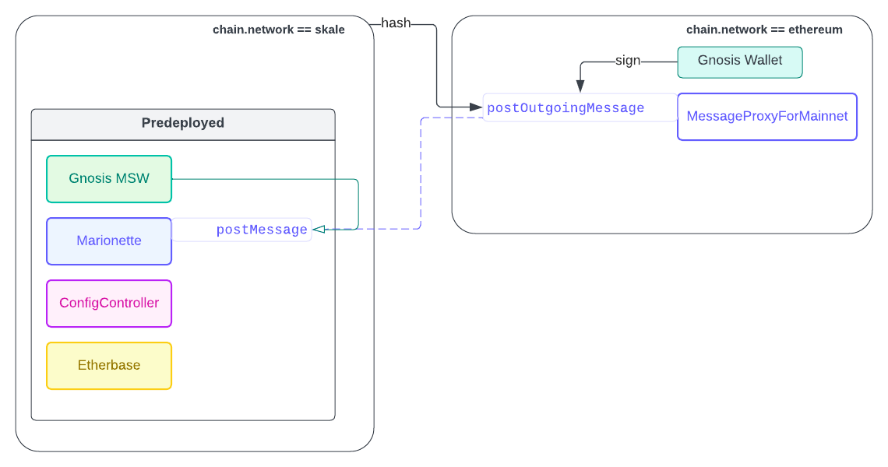

<div align="center" style="background: black; color: white; padding: 20px 0; border-radius: 5px;">
<h2 style="color: white;">
<br>
SKALE Chain — Admin UI
</h2>
<span style="font-size: small; padding: 2px 10px; letter-spacing: 2px; color: white; border-radius: 3px; font-weight: 700">DEVELOPER GUIDE</span>
</div>

# Prelude


To build a flying car that actually flies:

- Make sure that the car is drivable at all times.

- Ensure that the modularity inspires _maintainable_ reusability.

- Meditate.

<br clear="both">

Use node version `^18.12`

# Setup

- Install dependencies

```
pnpm install
```

- Refresh known Schains

```bash
pnpm compile:chains
```

- Run DApp locally

```bash
pnpm dev:app
```

- Or, Build for production

```bash
pnpm build:app
```

Build output goes to `app/dist`, from where it can be deployed to any static host.

# Structure

This repo follows a _lite microfrontend_ architecture, which means there will be parallels in design decisions, but not a zealous overlap. On further reviews, if enough antipatterns are found, a suitable name for this architecture should be _meshfrontend_.

The aim is to strike a balance between:

1. Re-usability of _features_ by ecosystem projects
2. Maintainable contributions from across communities

# Packages

For re-usability across the ecosystem, following is distinctly made available from the repository.

:package: Intuitive react hook libraries integrated with SKALE Network - `@skalenetwork/feat`

:crystal_ball: UI compositions including various flows for Schain management - `@skalenetwork/admin-ui/screens`

:bricks: Reusable common components following SKALE's design system, built with headless accessible libraries - `@skalenetwork/ux/components`

:droplet: JSX UI Elements with some context dependency - `@skalenetwork/ux/elements`

:goggles: Well-typed interfaces exported alongside relevant modules

> :scroll: Package exports can currently only be imported as TS, and require necessary aliasing in `tsconfig`, and in js bundling. Example with vite+TS can be found in `/app`

# :package: Features

SKALE Network capabilities are divided into features by usability domains.

All features require `wagmi` + `react-query` context, exporting:

1. TypeScript utility functions
2. React TS hooks

Current features include:

1. network (primitives)
2. control
3. analytics
4. bridge (token bridging)
5. icm (interchain messaging)
6. multisig
7. storage

Following is a breakdown of the foundational feature.

## Network feature

`@/features/network`

Network feature offers extensive support for network building blocks, such as SKALE pre-deployed contracts.

All transactional operations are integrated with SKALE access control.

- Use typed contracts
- Use utility APIs on top of contracts
- Use convenience hooks

Network feature is based on a configuration layer.

> :scroll: Configuration layer is independently scalable. It employs the least common format, which can be versioned, and extended to match change in the network complexity.

### Configuration: Constants

None-to-slow-changing data

- **`address.ts`** All unique preset addresses
- **`chains/*.ts`** Recognized SChains using a standard `Chain` type, IDed by `chainName`.

### Configuration: Manifests

Slow-to-medium-changing data

Manifests cater to contracts, ABIs, and wrapper APIs.

> :scroll: Manifests can best evolve to become compile-targets of releases made within `skalenetwork/*`. Following that, they may become a standalone distribution.

- **`manifest.ts`** Re-export of manifests and utility methods

- **`contract.ts`** Entry point of following manifests, indexing pre-deployed and other known network contracts with `ContractId`

- **`abi/abi.ts`** Re-export of individual ABIs `abi/abi-*.ts`, indexed by `ContractId`

- **`api.ts`** Re-export of standard initiators for individual APIs imported from various ecosystem libraries, indexed by `ContractId`

> **_Why redistribute JSON ABIs as .ts files?_** We need the narrowest `Abi` type, producible by a `const` assertion. TS currently doesn't _(want to)_ support JSON `as const` https://github.com/microsoft/TypeScript/issues/32063

Example usage of exposed getters:

```ts
const address = getSContractProp('CONFIG_CONTROLLER', 'address');
const abi = getAbi('CONFIG_CONTROLLER');

// and reverse

const contractId = build.contractIdFromAddress(address);
const { abi, address } = build.addressAbiPair(contractId);
```

### Configuration: Registry

Medium-to-fast changing data

Registry is a loose implementation around the idea of registering off-chain / near-chain metadata within a module.

Presently registered metadata includes:

- chainlists
- `skale-network`: `metadata/mainnet/chains.json`
- `admin-ui`: `metadata/roles.json`

# :crystal_ball: Screens

It may help to think of screens as _portals_ to stateful features.

Screens are composed of UI widgets linked to UI flows that execute operations on SChain.

They are like pages served in any frontend; Except, all _screens_ are exported independent of each other, and usable in any DApp.

# Usage of `feat`ures

## Install

```sh
pnpm install -P @skalenetwork/feat
```

## Setup

All react hooks are operational only within `wagmi` context.

```tsx
/** in your entrypoint file **/

// within main renderer
<WagmiConfig client={wagmiClient}>
  <App />
</WagmiConfig>
```

Refer to [wagmi docs](https://wagmi.sh/react/getting-started) for complete setup example.

## Examples

**Read a single value** from a pre-deployed contract

```tsx
const { data } = useSContractRead('TOKEN_MANAGER_ERC20', {
  name: 'automaticDeploy',
});
```

**Read multiple values** from a pre-deployed contract

```tsx
// multi-read fits best with TS for similarly typed return values
const { data, status, refetch } = useSContractReads('CONFIG_CONTROLLER', {
  reads: [
    {
      name: 'isMTMEnabled',
    },
    {
      name: 'isFCDEnabled',
    },
  ],
});
```

**Write** to a pre-deployed contract

```ts
import { useSContractWrite } from '@skalenetwork/admin-ui/features';

const writer = useSContractWrite('TOKEN_MANAGER_LINKER', {
  name: 'connectSChain',
  args: ['staging-aware-chief-gianfar'],
});
```

handle with side effects

```tsx
const { isLoading, isSuccess, isConfirmed, receipt } = writer;

useEffect(() => {
  // when confirmed
}, [receipt]);

const handleSubmit = useCallback(() => {
  writer?.write();
}. [writer.write]);
```

handle with promises

```tsx
const handleSubmitWithConfirm = useCallback(async () => {
  if (!writer.writeAsync) return;
  const receipt = await writer.writeAsync(true);
}, [writer.writeAsync]);
```

**What else is in the `writer`?**

`writer` exposes `status` of the contract mutation through its lifecycle.

- from `idle`
- through `loading`
- to `success` or `error`
- back to `idle` if auto or manually `reset()`

```tsx
const { eoa, mnm, ...rest } = writer;
```

- `eoa` writer where Externally Owned Account (EOA) is signer

- `mnm` writer where EOA is owner of `MultiSig`, and submits a transaction that is routed through `Marionette`

- `rest` is copy of either `eoa` or `mnm`, whichever is authorized, where precedence is given to `eoa`

`writer.writeAsync` or `writer.write` execute an already prepared transaction. These methods will only be available if:

1. `args` are passed as expected into `useSContractWrite` options
2. there are no authorization exceptions
3. there are no `require` failures in method call

> :scroll: SKALE Contract writer hook performs eager validation on destination method call. This validation works as expected in case of EOA-signed transactions. :arrow_upper_right: [Learn more](https://wagmi.sh/react/prepare-hooks#no-upfront-validation) about underlying contract call preparation done by `wagmi`.

> :warning: The eager validation may cause wallet injected scripts to log errors pre-emptively in console. Example: `MetaMask - RPC Error`

Both `writer`s extend the return data of `wagmi`.`useContractWrite`, with more state values.

```tsx
const { action, multisigData, receipt, isConfirmed, isFailed } = rest;

const natureOfDestinationContractCallThroughMariontteViaMultisig = {
  isConfirmExistingIdenticalTx: action === 'confirm',
  isExecuteExistingIdenticalTx: action === 'execute',
  isSubmitNewTx: action === 'submit',
};

const countMultisigConfirmations = multisigData?.countConfirmed;
const countMultisigRequiredConfirmations = multisigData?.countRequired;
```

**Guard** UI actions from unready writer

```tsx
<button disabled={!!writer.writeAsync}>Guarded Action</button>
```

**Guard and guide** action with a well-formatted button using `SButton` element from `@skalenetwork/ux/elements`

```jsx
<SButton writer={writer}>Guarded Action</SButton>
```

**Preview a guarded action** button without `writer` execution on click

```jsx
// usage as a preview that opens a separate flow

<SButton writer={writer} noWrite onClick={(e) => openModal()}>
  Open Modal
</SButton>
```

---

# @next

`@/features/icm`

Among features, ICM (inter-chain messaging) is a domain that would horizontally complete `@/features`.

Diagram highlighting typical cross-chain interaction. On the contrary, arbitrary message passing is more suitable for `icm` whereas `multsig` could be one of the consumers of `icm` when supporting foreign multisigs.


# Links

## Consumables

- [skale.js](https://github.com/Dirt-Road-Development/skale.js)

- [IMA-js](https://github.com/skalenetwork/ima-js)

- [RPC Support Spec](https://github.com/skalenetwork/skaled/blob/docs-v3.14.x/docs/modules/ROOT/pages/json-rpc-interface.adoc)

- [Staging Network List](http://staging-v3.skalenodes.com/#/)

- [Mainnet Network List](http://mainnet.skalenodes.com/#/)

## Notable Projects

- [Multisig Wallet CLI](https://github.com/skalenetwork/multisigwallet-cli)

- [Metaport](https://github.com/skalenetwork/metaport)

- [Network UI](https://github.com/skalenetwork/network-ui)

- [Filestorage UI](https://github.com/skalenetwork/filestorage-ui)
